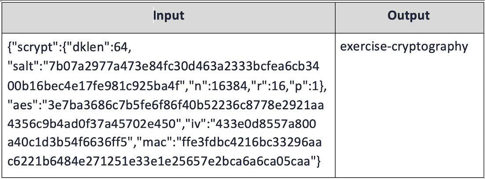

# Cryptography: Hashes

Write code to play with popular cryptographic algorithms using crypto libraries in various programming languages. Calculate hashes, derive keys from passwords, encrypt and decrypt messages, sign messages and verify message signatures, and derive blockchain addresses from ECC private keys.

## Resources

Refer to the demos folder for sample calculations. Refer to the exercise-resources folder for sample inputs and outputs.

## Python Libraries
* [hashlib](https://pypi.org/project/hashlib/)
* [hmac](https://pypi.org/project/hmac/)
* [scrypt](https://pypi.org/project/scrypt/)

## Calculate Hashes

Write a program to calculate hashes of the given text message using the following hash functions:

1.	SHA256
2.  SHA3-256
3.	SHA512
4.	RIPEMD160

## Calculate HMAC

Write a program to calculate HMAC-SHA-256 of the given text message by given key.

## Derive Key by Password using SCrypt

Write a program to calculate a 256-bit key by a given string password and salt using SCrypt.

Use the following configuration for SCrypt:
*	16384 iterations
*	16 block size
*	1 parallel factor

Note: You will also need to install openssl (v1.1.0+) for this package to work if you don’t have it installed already.

## Symmetric Encryption / Decryption

Write a program to encrypt a text message using a given password. 
*	Derive a 512-bit key from the password using SCrypt (n=16384, r=16, p=1) with random salt (256 bits).

    *	Split the derived key into two 256-bit sub-keys:  
        * encryption key 
        * HMAC key 

*	Encrypt the message using AES-256 (CBC mode with PKCS7 padding) using the encryption key. 
    *	Use a random 256-bit IV (initialization vector). 
*	Calculate message authentication code (MAC) using HMAC-SHA256(msg, hmac_key).

Input: message + password. 
Output: JSON document, holding the following assets:

*	The SCrypt parameters: n, r, p, salt (in hex format). 
*	The encrypted message (in hex format) from the AES cipher. 
*	AES parameter: IV (initialization vector) 
*	The message authentication code – MAC (in hex format). 

Write a program to decrypt the encrypted message using a given password. 
*	Derive a 512-bit key from the password using SCrypt (n=16384, r=16, p=1) with the salt (from the JSON). 

    *	Split the derived key into two 256-bit sub-keys:  
        * encryption key 
        * HMAC key. 
        
*	Calculate message authentication code (MAC) using HMAC-SHA256(msg, hmac_key). 
    *	Compare the MAC with the MAC in the JSON document  → correct / wrong password. 
    
*	Decrypt the message using AES-256 (CBC mode with PKCS7 padding) using the encryption key and the IV from the JSON. 

### Module
MI1: Module 3: E1
